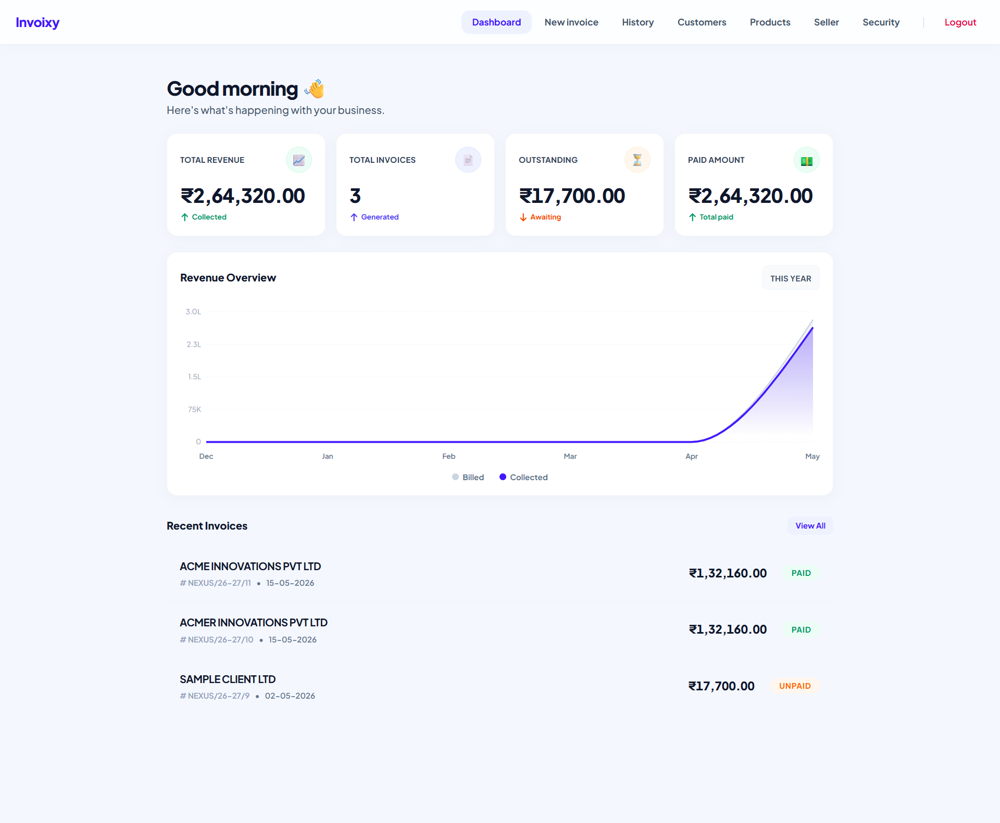
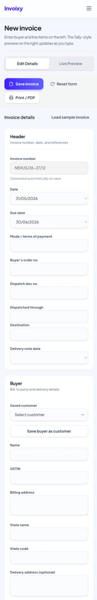
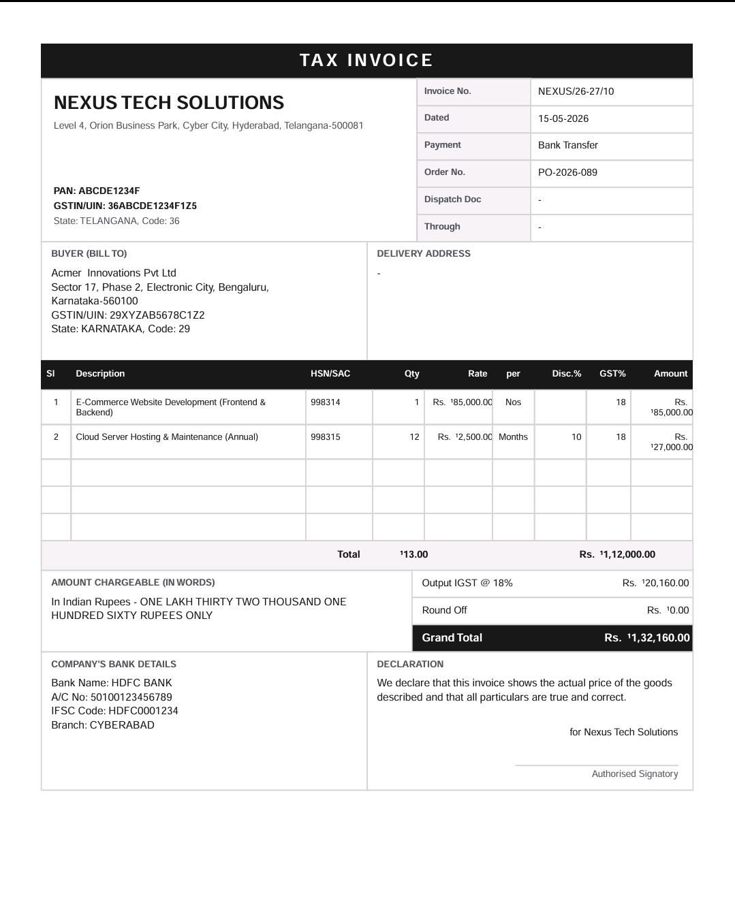
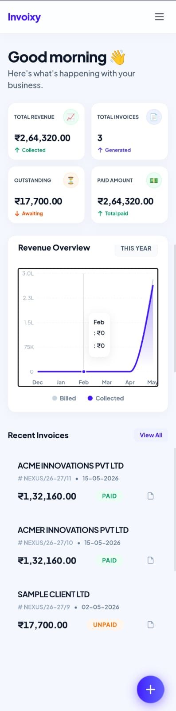
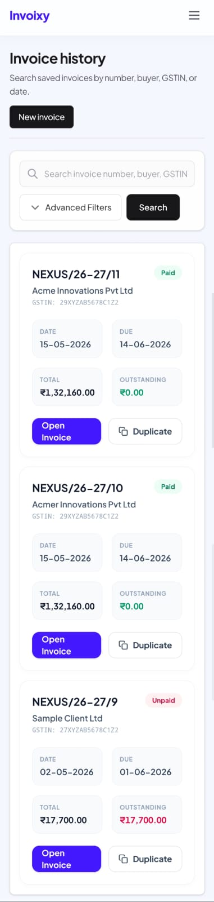

# Invoixy

**Invoixy** is a modern, open-source invoice management platform built for freelancers, agencies, and small businesses. It features a premium, sleek UI, fast invoice generation, and intuitive tracking for your income and outstanding bills.

## 📸 Screenshots

### Desktop Dashboard


### Create & Preview Invoices



### Mobile Experience
<p align="center">
  
  &nbsp; &nbsp; &nbsp;
  
</p>

## ✨ Features

- **Beautiful Dashboard:** Clean, glassmorphism-inspired UI with smooth animations.
- **Invoice Generation:** Quickly draft, edit, and duplicate professional invoices.
- **Mobile Responsive:** Works seamlessly on mobile devices and narrow screens.
- **Customer & Product Management:** Save products and customer details for rapid invoice building.
- **Financial Analytics:** Track total revenue, outstanding payments, and view your trends over time.

## 🚀 Tech Stack

- **Framework:** [Next.js App Router](https://nextjs.org/)
- **Database:** [Prisma](https://www.prisma.io/)
- **Styling:** [Tailwind CSS](https://tailwindcss.com/)
- **Charts:** [Recharts](https://recharts.org/)

## 🛠️ Getting Started

### Prerequisites
Make sure you have Node.js (v18+) and npm installed.

### Installation

1. **Clone the repository:**
   ```bash
   git clone https://github.com/shaikhumar70395-debug/invoixy.git
   cd invoixy
   ```

2. **Install dependencies:**
   ```bash
   npm install
   ```

3. **Set up the environment:**
   Create a `.env` file in the root directory and configure your database URL:
   ```env
   DATABASE_URL="file:./dev.db" # Or your PostgreSQL/MySQL URL
   ```

4. **Run database migrations:**
   ```bash
   npx prisma db push
   ```

5. **Start the development server:**
   ```bash
   npm run dev
   ```

6. Open [http://localhost:3000](http://localhost:3000) in your browser to see the app.

## 🤝 Contributing

We love contributions! If you'd like to help make Invoixy even better, please check out our [Contributing Guide](CONTRIBUTING.md) for details on how to get started.

## 📝 License

This project is licensed under the MIT License - see the [LICENSE](LICENSE) file for details.
